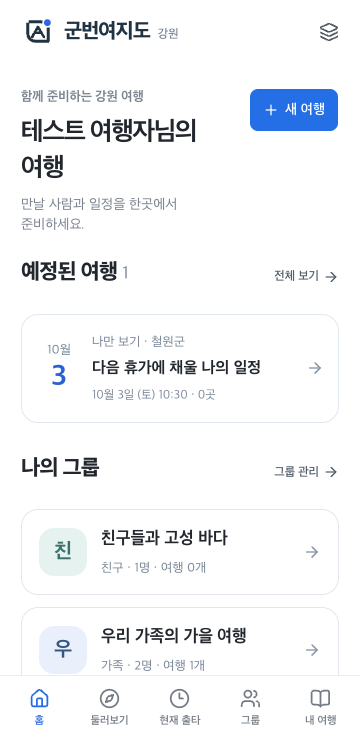
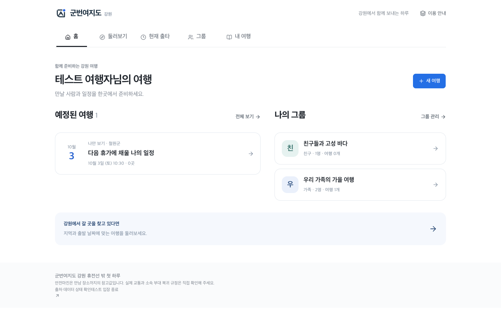

# 군번여지도 강원

**휴전선 밖 첫 하루. 장병과 가족·연인·친구가 함께 만드는 강원 여행.**

출타에 맞는 여행을 계획하고, 만나는 사람마다 그룹으로 일정을 나눕니다. 여행 중에는 개인 복귀 기준을 확인하고, 다녀온 뒤 비무장 패스포트에 기록합니다. **2026 관광데이터 활용 공모전 ① 웹·앱 개발 부문**을 위한 모바일 웹/PWA입니다.

[테스트 사이트 열기](https://gunbeon-yeojido-gangwon.ybuser.chatgpt.site/) · 임시 비밀번호 **1234** · ChatGPT 로그인 불필요

## 실제 화면

실행 중인 앱을 Chrome에서 촬영했습니다. 예시 그룹·일정은 검증용 데이터입니다.

| 홈 · 예정된 여행과 그룹 | 그룹 · 함께 관리하는 일정 |
|---|---|
|  |  |



## 이렇게 사용합니다

1. **함께 준비하기** — 홈 → 그룹 만들기 → 가족·연인·친구·동행 선택 → 초대 링크 전달. 초대받은 사람은 자기 브라우저에서 참여해 같은 여행을 봅니다.
2. **출발일 정하기** — 둘러보기 상단 날짜·시각을 누릅니다. 계획의 여유 시간은 그 출발 시각을 기준으로 계산하며, 현재 시각 때문에 줄어들지 않습니다.
3. **내 코스 만들기** — 빈 여행을 먼저 저장하거나 추천 코스를 가져옵니다. TourAPI 검색·가까운 장소·즐겨찾기·지도/직접 입력으로 최대 12곳을 담고 순서와 체류 시간을 바꿉니다.
4. **그룹에 공유하기** — 개인 여행을 선택하거나 그룹 안에서 새 일정을 만듭니다. 직접 지정한 장소는 포함 여부를 확인합니다. 동시 수정 충돌 시 자신의 변경을 새 여행 사본으로 저장할 수 있습니다.
5. **출타와 기록** — 내 여행에 담은 뒤 개인 복귀 기준을 정하고 ‘출타 시작’을 누릅니다. 여행이 끝나면 ‘여행 완료’ 확인 후 스탬프를 남깁니다.

## 구현 범위

- 홈의 예정된 여행·소속 그룹, 그룹별 여러 일정, 다른 기기 초대·공동 편집
- 1~4칸 코스 사진, 직접 코스 편집, 즐겨찾는 만남 장소, 빈 일정 저장
- 계획용 지도·미션과 실시간 현재 출타 분리, 거리 추정 기반 복귀 여유
- 부모의 도보·주차·실내 대안·식사·날씨 브리핑, 비무장 패스포트와 방문 준비 안내
- 출처·갱신 상태 표시, 한국관광공사 서버 API 어댑터, 무장애·기상청·Kakao 지도
- SVG 로고·파비콘·PWA 아이콘, 모바일 하단 5메뉴와 데스크톱 반응형

## 데이터와 저장

TourAPI `areaBasedList2`는 2026-09-08 실측에서 **HTTP 429 / 오류 22: 일일 호출 한도 초과**를 반환했습니다. 코드 조회는 성공했습니다. 키가 없어서 발생한 오류가 아닙니다. UI와 서버에서 원인을 구분하고 반복 호출을 차단합니다. [원인·공식 정책·증설/저장 신청 안내](reports/tourapi_operations_policy.md).

관광공사 정책과 개발 부문 FAQ에 별도 저장 조건이 있어 **TourAPI 응답을 운영 DB에 적재하는 기능은 적용하지 않았습니다.** 페이지 메모리로 API 응답을 재사용하고 새로고침 시 초기화합니다. 이미지는 CORS가 허용되면 Blob 메모리(최대 48 MiB), 그 외에는 원본과 브라우저 캐시를 사용합니다. 모든 출처의 이미지 재사용이 보장되는 것은 아닙니다.

그룹·멤버·공유 일정은 D1 DB에 저장합니다. 개인 일정·즐겨찾기·출타·스탬프는 사용한 브라우저에 저장됩니다. 그룹에는 출발 예정 시각과 선택한 장소를 공유하되, 개인 복귀시각·진행 상태·스탬프는 보내지 않습니다. 직접 입력한 장소 이름·주소·좌표는 확인창에서 선택했을 때만 그룹에 포함합니다. 공개 공유 카드는 개인 장소와 정확한 시각을 제외합니다.

참여 방식은 브라우저 쿠키 기반 테스트 인증입니다. 본인 인증이나 계정 복구를 제공하지 않으며, 쿠키 삭제·기기 변경 시 새 초대가 필요합니다. 초대는 72시간 동안 유효하고 관리자에게 취소·멤버 제외·그룹 삭제 기능이 있습니다.

## 시작

Node.js 22.13 이상.

```sh
cp .env.example .env.local
cd web
npm ci
# web/.env.local이 없다면 상위 설정 연결
ln -s ../.env.local .env.local
npx wrangler d1 migrations apply DB --local --config wrangler.local.jsonc
npm run dev
```

저장소 루트 `.env.local`의 `DATA_GO_KR_SERVICE_KEY`에 공통 일반 인증키를 한 번 입력한 후 개발 서버를 재시작하세요. [신청할 API와 키 형식](reports/api_setup.md). 키는 서버에만 보관하고 Git/채팅에 올리지 않습니다. `TEST_ACCESS_PASSWORD`와 32바이트 이상의 무작위 `TEST_SESSION_SECRET`도 설정해야 합니다. 로컬 설정과 배포 secret은 별개입니다. Kakao JavaScript 키는 공개 브라우저 키로 사용하며 허용 도메인 등록이 필요합니다.

```sh
cd web
npm run typecheck
npm test
npm run build
# 설치된 Chrome·Edge에서 실제 API 사용 (별도 브라우저 프로필)
npm run test:browser
npm run test:custom
npm run test:outing
npm run test:groups
npm run test:groups-ui
```

브라우저 재현 방법과 API 실패 검사 설정은 [QA 보고서](reports/browser_qa_report.md)에 있습니다. CI는 키 없이 Chromium에서 장애 대응 흐름을 실행합니다.

## 개발 및 검증

React 19 · TypeScript · Tailwind · Vinext/App Router · Sites · D1/Drizzle. 환경변수는 `.env.local`과 배포 secret으로 관리하며 키는 Git에 저장하지 않습니다.

- [그룹·UX·데이터 운영 및 다음 계획](reports/travel_groups_delivery.md)
- [공식 규정](reports/notion_requirements.md) · [개발 계획](reports/implementation_plan.md) · [제출 준비](reports/submission_assets.md)
- [검증 결과](reports/qa/travel-groups/) · [이전 계획/현재 출타 검증](reports/planning_outing_delivery.md)
- `web/lib/domain.ts`: 복귀 시간·미션·공유 모델 / `web/lib/tour-api.ts`: 관광공사 어댑터
- `web/db/schema.ts`, `web/drizzle/`: 그룹 DB 스키마와 마이그레이션
- `web/scripts/`: 재현 가능한 브라우저·API 검사 / `reports/`: 요구사항·결정·근거

단위 검사 55개, 그룹 API 11개 케이스, Chrome·Edge 4개 화면 크기로 검증했습니다. 실제 휴대폰 OS/Safari·현장 조건은 별도 검증 대상입니다. 이번 UI 검사에서 관광공사 목록은 한도 초과 응답으로 격리했으며 실시간 목록 성공을 의미하지 않습니다. 전체 lint의 기존 규칙 오류는 남아 있습니다.

## 출처와 한계

강원 접경 5군 중심이며 춘천·속초는 관문으로 활용합니다. 통일부 DMZ 관광/카페 CSV와 국가보훈부 공개 데이터를 정규화한 기본 장소를 사용하고, 한국관광공사 응답은 수신 여부·출처를 구분합니다. 이전 실응답 검증: [데이터 리포트](reports/data_validation_summary.md).

교통·도보는 거리 기반 추정입니다. 예약·운영·실제 이동과 소속 부대 복귀 규정은 직접 확인해야 합니다. 휴가회수 레이더는 제도 준비 안내이며 보상을 보장하지 않습니다. GPS 자동 수집·군번·작전·근무정보·휴가증·신분증 이미지 입력 기능은 없습니다.

공사 출처: ⓒ한국관광공사. 고석정 사진: 한국문화관광연구원(2015), [공공누리 제1유형](https://www.kogl.or.kr/recommend/recommendDivView.do?division=img&oc=&recommendIdx=2453). 각 원천의 이미지 이용조건을 따릅니다.
