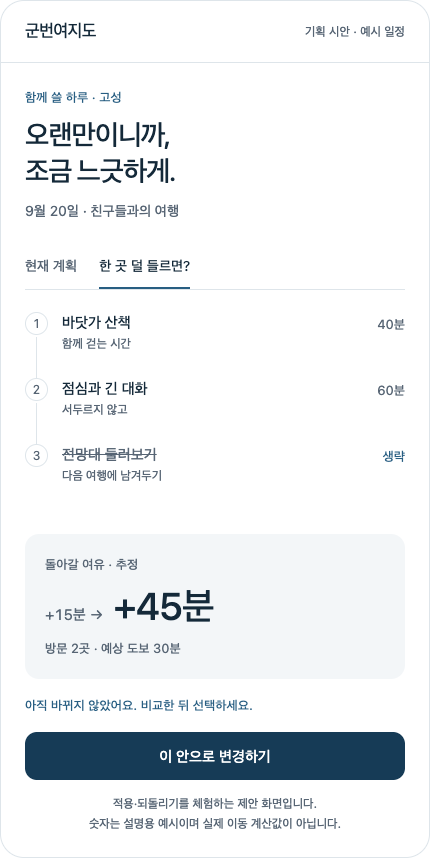

# 군번여지도 — 기억에 남는 경험 제안

2026-09-08 · ① 웹·앱 개발 부문 · **기획안이며 아직 구현하지 않음**

## 제안: 기다리던 하루를, 함께.

**‘하루 여권’**을 군번여지도의 대표 경험으로 만든다. 함께 고른 계획이 출발 준비를 거쳐 다녀온 하루의 기록으로 바뀌는 경험이다. 새로운 탭을 늘리기보다, 기존 일정·그룹·출타·기록을 하나의 표지 디자인으로 연결한다.

실제 사용에서 기억에 남을 기능은 **‘여유 조정’**으로 좁힌다. 출발 전에 한 장소를 빼거나 머무는 시간을 줄였을 때, 돌아갈 여유와 도보 추정이 얼마나 달라지는지 비교하고 적용한다. 첫 사용에는 이 흐름을 설명하는 **선택형 16초 모션 안내**를 제공한다. 영상의 인상과 실제 효용이 같은 이야기를 하도록 만드는 전략이다.

## 현재 기능과 신규 제안

현재 상태는 [최신 전달 기록](discovery_delivery.md)과 [사용 가이드](usage_guide.md)를 기준으로 검토했다.

| 현재 구현 | 이번 제안 |
|---|---|
| 날짜 없는 추천 15개, 1–4장 코스 사진 | 사진 창문과 여정선을 일정 표지·기록까지 일관되게 연결 |
| 개인 일정 편집, 다양한 그룹과 공동 계획 | 가장 가까운 일정의 ‘하루 여권’ 표지, 그룹 관계를 자연스럽게 표시 |
| 출타 중 남은 시간·복귀 여유 계산 | **저장된 계획·출발 전**에 조정안 비교 → 적용 → 되돌리기 |
| 여행 완료 확인 후 스탬프·공유 카드 | 실제 다녀온 장소를 선택 확인한 뒤 ‘하루의 한 장’ 만들기 |
| 실제 화면 사용 가이드 8장 | 처음 이용할 때 선택해서 보는 16초 이야기 사용법 |

현재 진행 중인 출타의 일정 편집은 잠겨 있다. 첫 릴리스에서는 이 구조를 유지한다. 기존 시간 계산이나 스탬프를 새 기능으로 포장하지 않고, **변경 전후 비교와 기록 표현**을 추가한다.

### 조작 가능한 제안 시안에서 확인한 화면

아래는 운영 서비스 스크린샷이 아니라 **설명용 일정과 수치로 만든 기획 시안**이다. 비교 → 적용 → 변경 전 미리보기 → 되돌리기를 확인했다. 실제 이동 계산·일정 저장 기능은 아직 연결하지 않았다.

Chrome의 320/736px, 밝은/어두운 테마와 모션 감소 설정에서 조작·가로 넘침·스크립트 오류를 확인했다. [시안 검사 기록](qa/planning-strategy/mockup.json). 이 결과를 실제 서비스 기능이나 실기기 검증으로 확대하지 않는다.

## 경험을 적용할 세 지점

### 1. 계획: 함께 쓸 하루

홈의 가장 가까운 일정 하나를 큰 표지로 보여준다. 지역명·여행 제목·날짜·동행 그룹·장소 사진이 내용이며, 주 버튼은 ‘계속 계획하기’다. 나머지 일정과 그룹은 기존 목록에서 찾는다. 날짜 없는 둘러보기는 유지하고, 날짜나 개인 복귀시계는 다시 넣지 않는다.

일정이 없는 첫 화면에는 ‘기다리던 하루를, 함께.’와 ‘코스 둘러보기 / 초대받은 그룹 들어가기’를 둔다. 모션 안내는 보조 행동이다. 초대 링크로 입장하면 그룹 가입이 우선이고, 재방문자는 바로 자신의 일정을 본다.

### 2. 출발 전: 여유 조정

저장된 계획의 편집 또는 출발 확인에서 ‘한 곳 덜 들르면?’을 선택하면 원래 계획과 조정안을 나란히 보여준다.

예시: **장소 3→2곳 / 도보 추정 50→30분 / 복귀 여유 추정 +15→+45분.** 이 수치는 설명용이며 실제 화면에서는 장소·체류·이동 계산 결과만 표시한다. ‘이대로 변경’을 누르기 전에는 원본이 바뀌지 않고, 적용 직후 되돌릴 수 있다.

- 첫 범위는 선택한 관광지 생략과 체류시간 직접 조정이다. 만나는 곳·돌아올 곳은 자동 제거하지 않고, 순서 자동 최적화는 하지 않는다.
- 장소를 제거하면 연결 이동을 다시 계산한다. 제거한 체류시간만큼 여유가 반드시 늘어난다고 가정하지 않는다.
- 저장 계획의 날짜·시각을 기준으로 비교한다. 계획 날짜가 없는 경우 필요한 입력을 먼저 안내한다. 빈 코스·좌표 결측도 그럴듯한 숫자로 채우지 않는다.
- 강원 장소의 예약·신분확인·야외/도보·무장애 정보를 비교에 연결한다. 미제공은 ‘확인 필요’이며, 길찾기·운영 확인이나 안전을 보장하지 않는다.
- 개인 복귀 기준은 그룹에 자동 공개하지 않는다. 방문 순서·체류시간 공유는 기존 공유 확인을 거친다.

**현재 출타 중 조정은 후속 설계다.** 진행 중인 여행을 별도 활성 일정 사본으로 다루고, 원래 저장 계획·이미 완료한 장소·마지막 진행 위치를 보존해야 한다. 변경 내역과 되돌리기, 현재 시각 기준 재계산을 검증한 뒤 추가한다. 첫 릴리스 시연에서 가능한 기능으로 설명하지 않는다.

### 3. 완료: 함께 다녀온 하루

여행 완료 후 지역·다녀온 장소·직접 남긴 스탬프를 한 장으로 만든다. 예시는 ‘고성에서 함께 보낸 하루’다. **현재의 여행 전체 완료 확인만으로 모든 계획 장소를 방문했다고 판단하면 안 된다.** 기록 생성 전에 실제 다녀온 장소를 사용자가 선택·확인하는 단계가 추가로 필요하다. 이는 직접 기록이며 공적 방문 인증이나 휴가 보상 증명이 아니다.

공유 이미지의 기본값은 **자체 벡터 여정선과 장소명**이다. 사진은 개별 라이선스의 재배포·편집·출처 조건과 브라우저 CORS 내보내기를 확인한 자산만 선택적으로 사용한다. 화면에 사진이 보인다고 이미지 파일로 재배포해도 된다고 가정하지 않는다. 지도 타일 캡처도 기본 구성에 넣지 않는다.

개인 만남 장소·복귀 시각·정확한 좌표·상세 경로·실명은 공개 카드에서 제외하고 내보내기 미리보기를 제공한다. 저장과 외부 공유는 사용자가 선택하며, 개인 완료 사실이 그룹 전체의 방문 기록으로 자동 전파되지 않게 한다.

## 디자인과 16초 이야기 사용법

흰 배경과 읽기 쉬운 정보 계층을 유지하되, 큰 한글 제목·실제 장소의 사진 창문·얇은 여정선으로 고유한 인상을 만든다. 여정선은 장소 순서의 개념도이며 실제 지도나 경로를 의미하지 않는다. 지역명과 작은 도장 형태로 철원·화천·양구·인제·고성을 구분한다. 완료 전환은 약 400ms의 짧은 움직임에 한정한다.

모바일에서는 한 손 조작과 읽기를 우선하고, 컴퓨터에서는 일정과 조정안을 좌우로 비교한다. 군사 장식·가짜 좌표·큰 베이지 면적·이모티콘·과도한 그라데이션을 브랜드의 중심으로 쓰지 않는다.

| 시간 | 화면과 이야기 |
|---|---|
| 0–3초 | 그룹 이름이 빈 여행 표지에 들어온다. **‘기다리던 휴가, 누구와 만날까요?’** |
| 3–6초 | 검증된 고성 사진과 장소명이 창문처럼 모인다. **‘함께 갈 곳을 골라요.’** |
| 6–10초 | 출발 전 한 장소를 줄이는 실제 UI와 비교 결과. **‘걷는 시간도, 돌아갈 여유도.’** |
| 10–14초 | 실제 다녀온 장소 확인 후 기록 한 장으로 전환. **‘다녀온 하루는, 우리 기록으로.’** |
| 14–16초 | **‘기다리던 하루를, 함께.’**에서 코스 둘러보기·그룹 참여로 연결 |

제품 기능을 완성한 뒤 해당 UI로 모션을 만든다. 미구현 기능을 먼저 영상에 넣어 현재 동작인 것처럼 보여주지 않는다. 사용 예시 일정임을 표시한다.

처음부터 ‘바로 시작’, 재생/일시정지, 자막·텍스트 설명을 제공하고 소리는 기본 꺼짐으로 둔다. 모션 감소 설정에서는 정적 안내 3장과 다음/이전 버튼을 제공한다. 초대 진입·재방문을 가로막지 않으며 안내를 닫으면 원래 맥락으로 돌아간다. [W3C 정지·숨김 기준](https://www.w3.org/WAI/WCAG22/Understanding/pause-stop-hide.html)과 [비필수 모션 제어](https://www.w3.org/WAI/WCAG22/Understanding/animation-from-interactions.html)를 참고하되, 설정 하나로 전체 접근성 적합성을 주장하지 않는다.

AI 영상은 선택적으로 첫 3초의 종이·빛·창문 같은 추상 움직임을 제작하는 데 사용할 수 있다. 실제 강원 풍경·군 시설·장병 얼굴을 사실처럼 생성하지 않는다. 앱 UI·한글·숫자는 코드와 편집으로 만든다. 결과는 선택 재생 시 로드하는 정적 영상이며 접속마다 AI 생성 API를 호출하지 않는다.

## 범위와 순서

작업량은 기존 코드 기반의 개발 추정이며 확정 일정이 아니다.

| 선택안 | 범위 | 추정 작업량 | 판단 |
|---|---|---|---|
| A | 표지 통일·정적 기록·선택형 사용법 모션 | 개발 1–2일 + 기기 QA | 빠른 인상 개선, 기능 차별은 제한적 |
| **B · 추천** | A + 출발 전 여유 조정·되돌리기·다녀온 장소 확인 | 개발 3–5일 + 사용자 관찰 | 기획력·데이터 활용·완성도의 균형 |
| C | B + AI 추상 오프닝·별도 홍보 편집본 | B에 제작·검수 2–4일 추가 가능 | 기능 검증 이후 확장 |

계산과 모션 자체의 추가 TourAPI·Kakao 호출은 **0을 목표**로 한다. 기존에 받은 허용 범위의 데이터를 이용하고, 새 장소 상세가 필요할 때만 기존 요청 경로를 사용한다. 응답 DB 저장이나 지도 타일 재사용이 허용됐다고 가정하지 않는다.

1. 홈 표지·출발 전 비교·완료 카드·모션 정지 장면을 먼저 같은 디자인으로 만든다.
2. 원본 보존, 계획 날짜 재현, 좌표 결측, 적용·되돌리기, 공유 범위를 구현한다.
3. 다녀온 장소 확인과 벡터 기반 카드 내보내기를 검증한다.
4. 실제 UI로 선택형 모션을 제작하고 기존 가이드에 연결한다.
5. 장병+부모, 장병+연인, 친구 그룹의 추천→편집→출발 전 조정→공유→출타→완료 시나리오를 작은/큰 휴대폰·컴퓨터에서 확인한다.

## 심사와 사용자 검증

① 웹·앱 개발 부문에서 16초 모션은 설명 도입부다. 실제 시연은 **TourAPI 장소·편의 정보 → 계획 조정의 근거 → 동행 공유 → 직접 기록**을 60–90초에 보여주는 구성이 적합하다. 영상만으로 기능 완성도나 수상 효과를 주장하지 않는다.

초기 관찰은 6–9명을 대상으로 한다. 제안 목표는 서비스 목적 10초 내 이해·도움 없는 첫 일정 저장·추정값 이해 각각 80% 이상, 계획/현재 시각 혼동 0건이다. 하루 뒤 ‘여유 조정’이나 ‘하루의 한 장’을 기억하는지도 묻는다. 작은 표본은 통계적 성과 입증으로 쓰지 않는다.

첫 저장까지 시간, 안내 건너뛰기, 조정안 적용·되돌리기, 카드 저장을 익명 합계로 확인하는 안을 검토한다. 개인 좌표·복귀 시각·그룹 관계를 분석 이벤트에 넣지 않는다. 안내 때문에 진입이 느려지면 노출을 줄인다.

## 참고한 공식 제품 사례

- [Airbnb 공동 여행 계획](https://news.airbnb.com/airbnb-2024-summer-release-highlights): 공동 위시리스트·초대 등으로 동행자를 계획의 참여자로 만든다. 군번여지도에는 이미 그룹 기능이 있으므로 채팅 추가보다 공동 일정의 표현을 강화한다.
- [Spotify Wrapped](https://newsroom.spotify.com/2025-12-03/2025-wrapped-user-experience/): 개인 기록을 이야기와 공유 가능한 시각물로 정리한다. 색상이나 순위보다 자신의 기록을 알아보는 단위를 참고한다.
- [Strava Year in Sport](https://support.strava.com/en-us/articles/15401959-your-year-in-sport): 활동·관계·기억을 장면으로 정리하고 사용자가 공유를 선택한다. 군번여지도에는 거리 경쟁보다 함께 다녀온 장소의 직접 기록이 맞다.

위 사례에서 도출한 것은 자체 설계 판단이다. 경쟁사의 성과를 군번여지도의 성과로 일반화하지 않는다. 챗봇·AR·랭킹·피드·전국 확장은 이번 범위에 추가하지 않는다.
