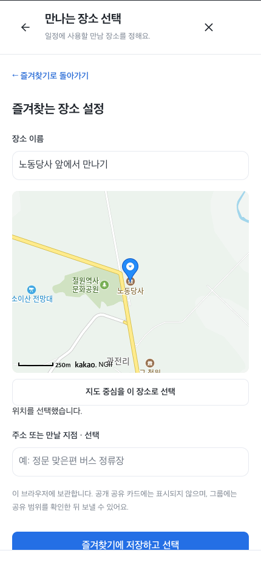
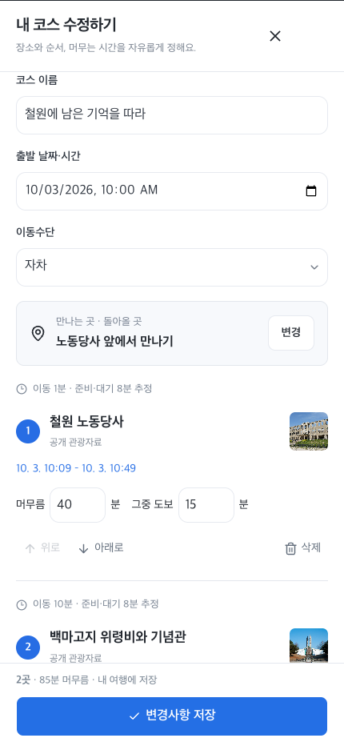
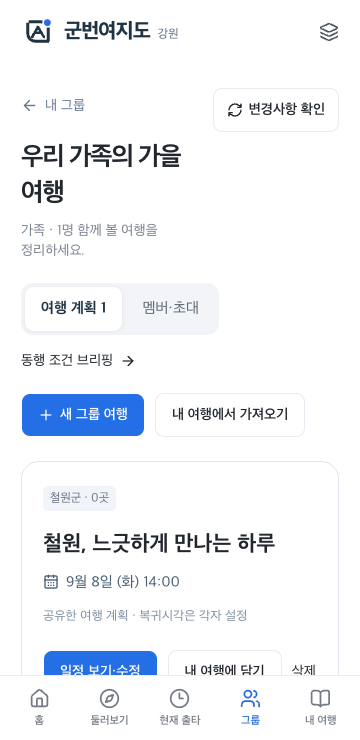
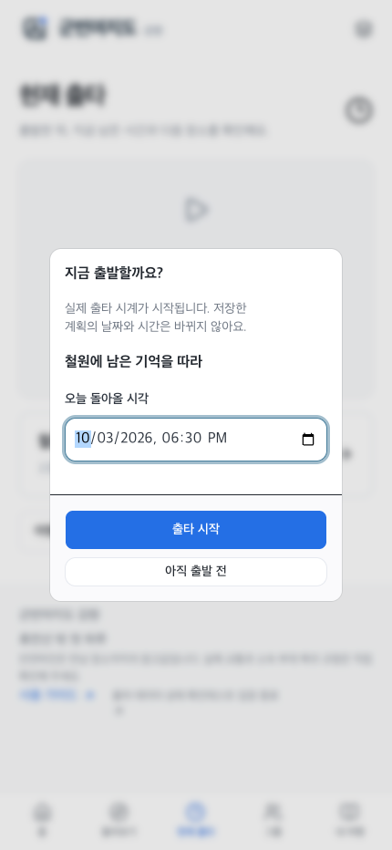
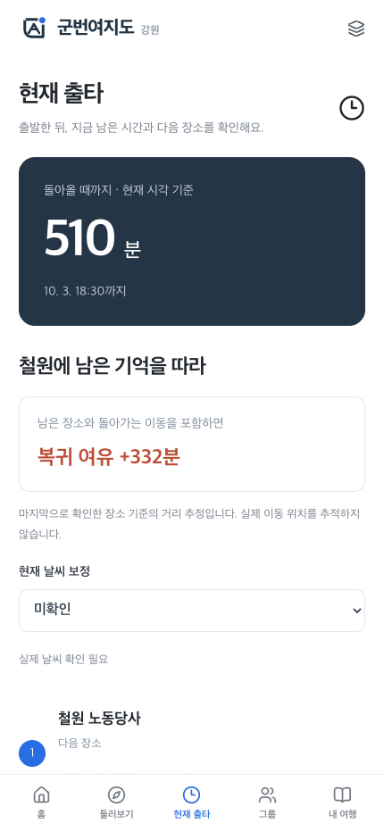
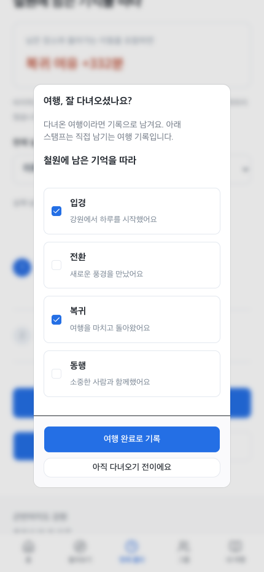

# 군번여지도 사용 가이드

[서비스에서 화면으로 보기](https://gunbeon-yeojido-gangwon.ybuser.chatgpt.site/guide) · 테스트 비밀번호 **1234**

2026-09-08 실제 Chrome에서 조작·촬영했습니다. 날짜는 예시이며, 테스트가 실제 방문을 의미하지 않습니다. 관광공사 일일 한도 초과 응답은 격리했고 기본 공공자료와 실제 카카오맵 SDK로 촬영했습니다.

## 1. 코스 찾기

둘러보기에서 지역과 취향을 고릅니다. 날짜·출발시간은 입력하지 않습니다. 장소가 나뉜 코스 표지를 눌러 방문 순서와 조건을 살펴보세요. ‘이 코스로 일정 만들기’로 가져오거나 ‘직접 만들기’로 빈 계획을 저장할 수 있습니다.

 

## 2. 내 일정으로 바꾸기

날짜와 돌아올 예정 시각은 일정표에서 정합니다. ‘만나는 곳 · 돌아올 곳’ 변경 → 즐겨찾기 선택 또는 지도에서 위치 지정. 다음에도 쓸 곳은 즐겨찾기에 저장하세요. 장소 추가에서는 가까운 후보, 관광정보 검색, 직접 입력이 가능합니다. 순서와 머무는 시간도 바꾸고 저장할 수 있습니다.

 

## 3. 함께 갈 사람끼리 공유하기

그룹에서 가족·연인·친구 등 함께할 사람을 정해 그룹을 만듭니다. ‘멤버·초대’에서 만든 링크를 전달하면 다른 기기에서도 참여할 수 있습니다. 그룹마다 여러 여행안을 만들 수 있고, 장소가 없는 빈 계획도 저장됩니다. 내 여행의 ‘그룹에 공유’로 기존 일정도 가져올 수 있습니다.

그룹 편집 → **공유 범위 확인** → **이 그룹에 공유/변경사항 공유**가 저장 완료 순서입니다. 직접 지정한 장소를 공유할지는 확인창에서 선택합니다. 개인 복귀 기준과 현재 진행·스탬프는 공유하지 않습니다.

## 4. 출발하는 날 현재 출타 시작

‘출타 시작’에서 오늘 돌아올 시각을 확인합니다. 만나는 장소가 없다면 여기서 설정을 이어갈 수 있습니다. 설정 후 돌아와도 입력한 오늘 복귀시각이 유지됩니다. 현재 출타에서는 현재 시각 기준 남은 시간, 다음 장소의 방문 정보·카카오맵 길찾기를 확인하세요.

‘이 장소 일정 마침’은 직접 진행을 표시하는 버튼입니다. 실시간 위치 추적이 아니며, 잘못 눌렀다면 마지막 진행을 되돌릴 수 있습니다. 저장한 계획 날짜는 현재 출타를 시작해도 바뀌지 않습니다.

 

## 5. 다녀온 뒤 완료 확인

여행 완료 → 다녀왔는지 확인 → 원하는 스탬프 선택 → 여행 완료로 기록. 아직 다녀오지 않았다면 취소하면 됩니다. 스탬프는 직접 남기는 여행 기록이며 방문 인증이나 휴가 보상 증명이 아닙니다.

## 저장과 이용 안내

- 내 여행·즐겨찾기·스탬프는 현재 브라우저, 그룹 일정은 서버에 저장합니다.
- 초대는 72시간 유효합니다. 테스트 인증은 쿠키 기반이므로 쿠키 삭제/다른 기기에서는 새 초대가 필요할 수 있습니다.
- 이동·도보는 추정값입니다. 예약·운영·실제 교통과 소속 부대 복귀 규정은 직접 확인하세요.
- 사진은 촬영 시점의 모습입니다. [사진 출처·검토 목록](photo_sources.md), [UX 검토와 다음 계획](discovery_ux_review.md), [테스트 결과](qa/discovery/)를 함께 확인할 수 있습니다.
