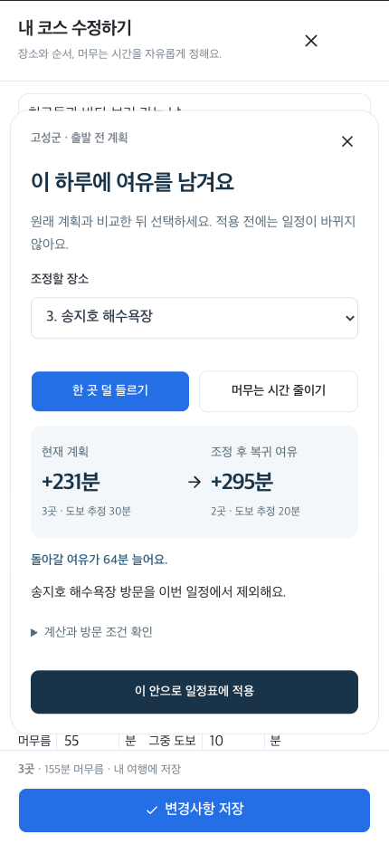
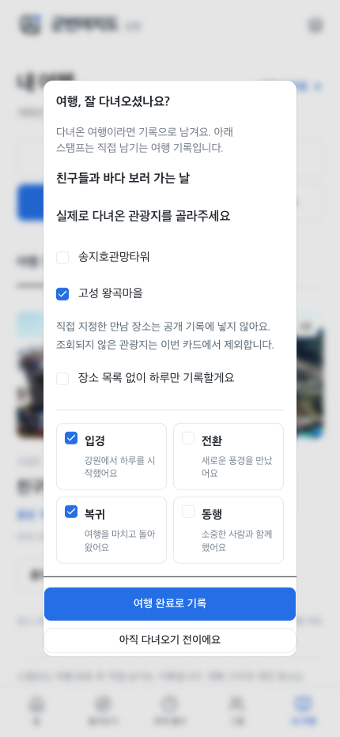
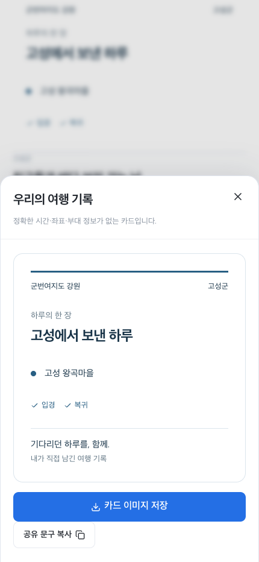

# 군번여지도 사용 가이드

[실제 화면으로 보는 가이드](https://gunbeon-yeojido-gangwon.ybuser.chatgpt.site/guide) · 임시 비밀번호 **1234** · [검증 기록](day_passport_delivery.md)

## 친구들과 고성에서 보내는 하루

1. **홈:** 예정된 여행 표지에서 ‘계속 계획하기’. 처음이라면 ‘새 여행’으로 빈 계획을 저장하거나 ‘둘러보기’에서 코스를 가져온다.
2. **함께할 사람:** 가족·연인·친구·동행 그룹을 만들고 초대 링크로 연결한다. 그룹별로 여러 계획을 관리한다.
3. **둘러보기:** 날짜 없이 지역·취향으로 추천을 고른다. 날짜와 돌아올 시각은 일정표에서 정한다.
4. **내 일정:** 즐겨찾기/지도에서 만나는 곳을 정한다. 가까운 장소·관광정보 검색·직접 입력으로 장소와 체류 시간을 편집한다.
5. **여유 조정:** 장소를 한 곳 덜 들르거나 머무는 시간을 줄인다. 원래 계획과 복귀 여유·도보 추정을 비교한다. ‘이 안으로 일정표에 적용’ → 아래 ‘변경사항 저장’. 저장 전에 다른 장소/시간을 편집하지 않았다면 ‘방금 조정 되돌리기’도 가능하다.
6. **그룹에 공유:** 개인 일정은 자동 공개되지 않는다. 공유 범위·직접 입력 장소 포함 여부를 확인하고 공유한다. 개인 복귀 기준과 출타 진행은 그룹에 보내지 않는다.
7. **실제로 출발:** ‘출타 시작’에서 오늘 돌아올 시각을 확인한다. 여기서만 현재 시각에 따라 남은 시간이 줄어든다. 진행 중인 일정 편집은 잠긴다.
8. **여행 완료:** 확인창에서 실제 다녀온 관광지와 남길 스탬프를 고른다. 장소 목록 없이 기록할 수도 있고, 아직이라면 취소한다. 계획의 모든 장소를 방문했다고 자동 처리하지 않는다.
9. **하루의 한 장:** 여행 기록 → 공유 카드에서 확인한 관광지·스탬프만 저장한다. SVG 이미지 또는 문구를 복사한다. 개인 제목·만남 장소·정확한 시간·좌표·상세 경로는 제외한다. 방문 정보가 미조회 상태이면 내보내기는 비활성화된다.
10. **짧은 안내:** 홈의 ‘16초로 사용법 보기’. 재생·정지·이전·다음·바로 시작을 제공하며 모션 감소 설정은 정지 화면으로 시작한다. 초대/재방문을 자동으로 막지 않는다.

## 새 기능 실제 화면

 

 

모든 촬영은 실제 앱 UI를 브라우저에서 조작한 결과다. 예시 개인 일정은 시나리오를 위해 넣은 자료다. 자동 회귀에서는 TourAPI 한도 응답과 별도 지도 시험 모형을 사용하고, 실제 TourAPI·Kakao 검사 결과는 분리 기록했다. [전체 12장 가이드](https://gunbeon-yeojido-gangwon.ybuser.chatgpt.site/guide)에는 기존 추천·일정·그룹·현재 출타 화면도 있다.

## 저장과 판단 범위

- 개인 여행·즐겨찾기·출타·스탬프는 현재 브라우저 저장. 그룹·초대·공유 일정은 서버 D1 저장. 새 PC의 Git clone은 개인 브라우저 데이터를 옮기지 않는다.
- 모션·비교 자체는 추가 관광 API 호출 없이 현재 장소 정보로 작동한다. 정상 추천·검색·상세·무장애 조회는 유지한다.
- 이동/도보는 추정값이며 실제 교통·예약·운영과 복귀 규정은 확인해야 한다. 스탬프는 직접 기록이며 방문 인증/휴가 보상 증명이 아니다.
- 공개 공유는 사용자가 선택한다. 사진/지도 타일을 내보내기 이미지에 복제하지 않는다.
